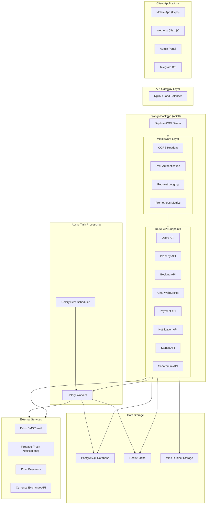
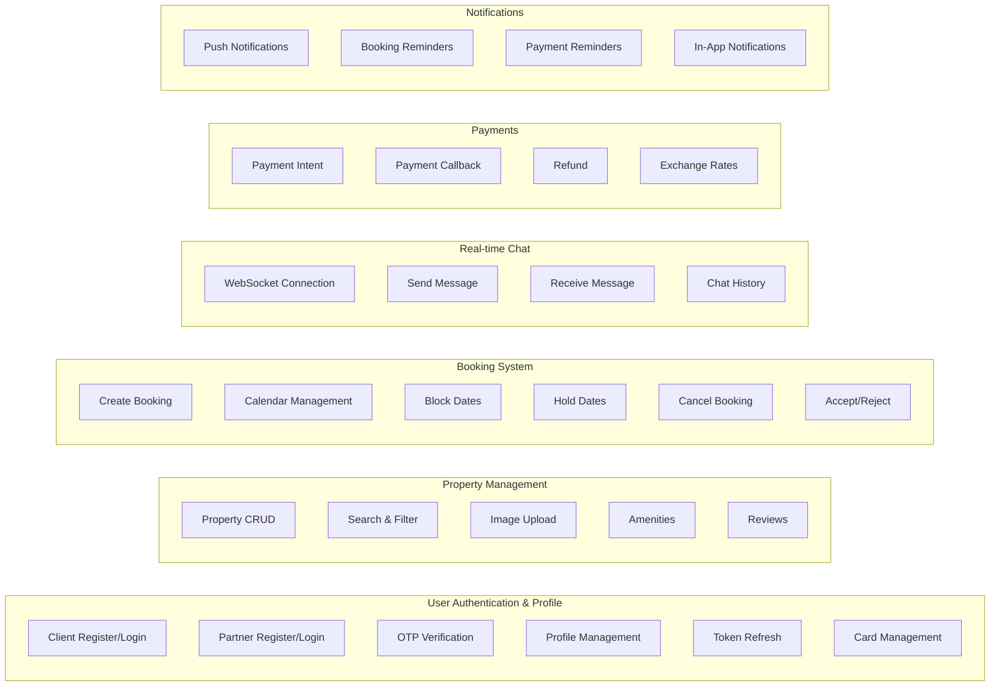
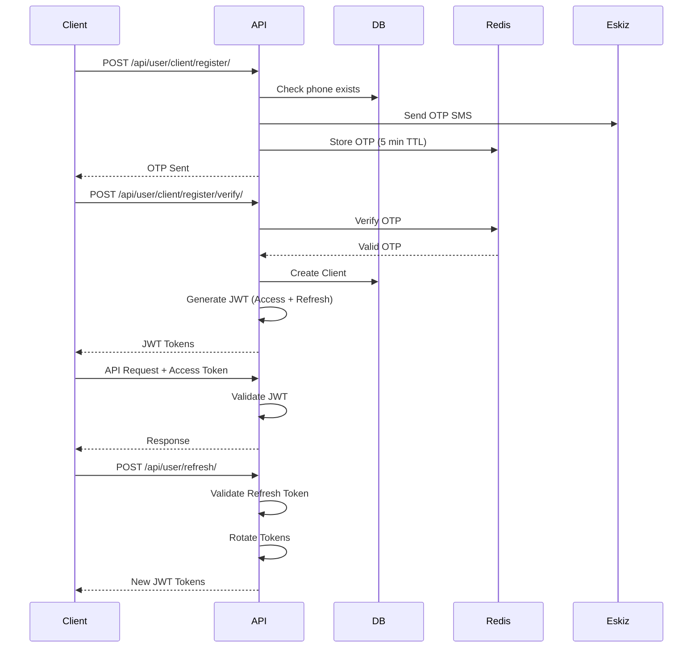
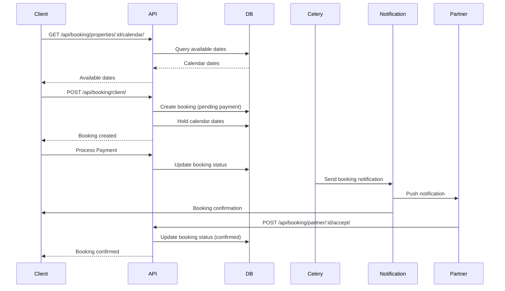
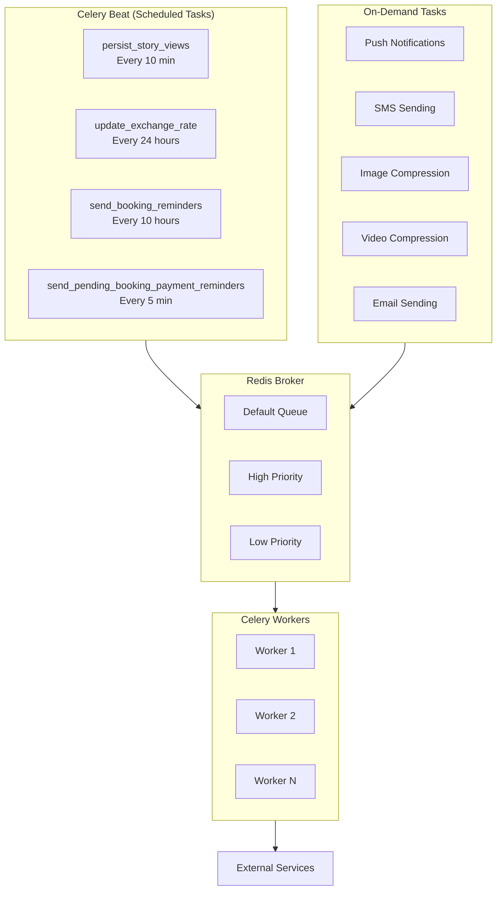
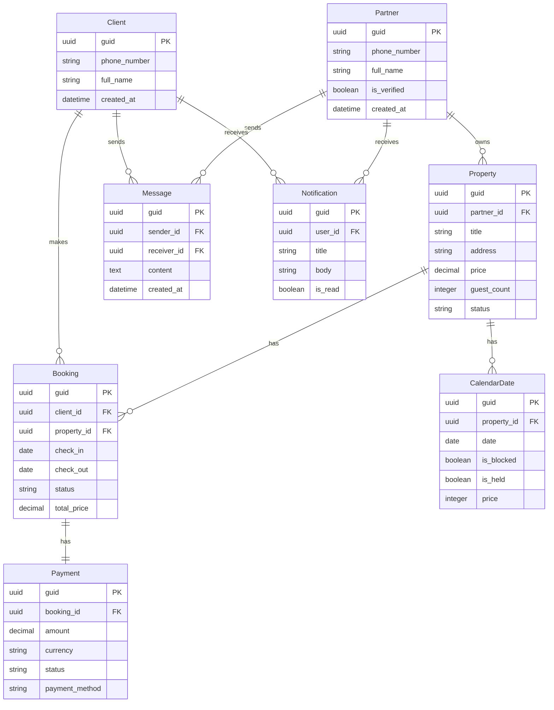
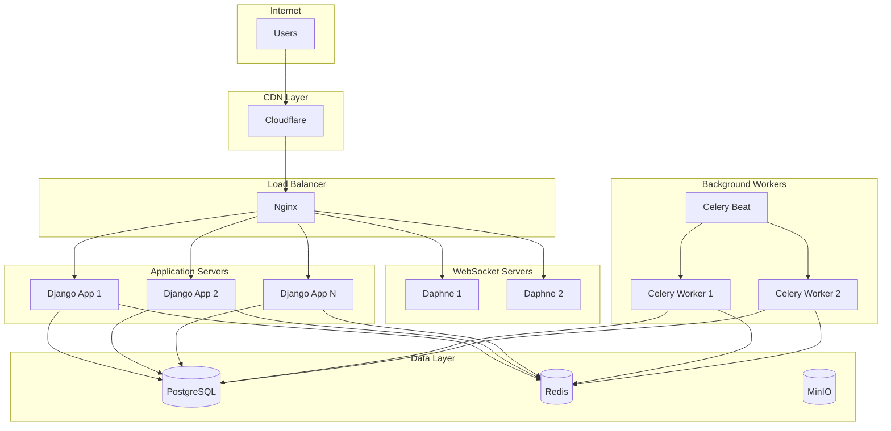

# Weel Backend Architecture Flowchart

## System Overview



## API Endpoint Architecture



## Authentication Flow



## Booking Flow



## WebSocket Chat Flow

```mermaid
flowchart TB
    Client1["Client 1"]
    Client2["Client 2"]
    
    subgraph WebSocket["Django Channels"]
        WSServer["ChatConsumer"]
        subgraph Channel["Channel Layer"]
            RedisChannel["Redis Channel"]
        end
    end
    
    subgraph Backend2["Backend"]
        DB[(Database)]
    end
    
    Client1 -- "ws://chat/" --> WSServer
    Client2 -- "ws://chat/" --> WSServer
    WSServer -- "Store/Read" --> DB
    WSServer <-> RedisChannel
```

## Celery Task Architecture



## Database Schema Overview



## Technology Stack

```
┌─────────────────────────────────────────────────────┐
│                    Frontend Apps                     │
│  ┌──────────┐  ┌──────────┐  ┌─────────────────┐   │
│  │   Expo   │  │ Next.js  │  │   Admin Panel   │   │
│  │  Mobile  │  │    Web   │  │  (Django Unfold)│   │
│  └──────────┘  └──────────┘  └─────────────────┘   │
└─────────────────────────────────────────────────────┘
                         │
                         ▼
┌─────────────────────────────────────────────────────┐
│                  API Layer                           │
│  ┌─────────────────────────────────────────────┐    │
│  │  Django REST Framework + Django Channels    │    │
│  │  - JWT Authentication (SimpleJWT)           │    │
│  │  - CORS Headers                            │    │
│  │  - Rate Limiting                           │    │
│  │  - Request Logging                         │    │
│  └─────────────────────────────────────────────┘    │
└─────────────────────────────────────────────────────┘
                         │
                         ▼
┌─────────────────────────────────────────────────────┐
│              Background Tasks                        │
│  ┌─────────────────────────────────────────────┐    │
│  │           Celery + Celery Beat              │    │
│  │  - SMS Notifications                        │    │
│  │  - Push Notifications (Firebase)            │    │
│  │  - Image/Video Compression                  │    │
│  │  - Scheduled Tasks                          │    │
│  └─────────────────────────────────────────────┘    │
└─────────────────────────────────────────────────────┘
                         │
                         ▼
┌─────────────────────────────────────────────────────┐
│               Data Storage                           │
│  ┌──────────┐  ┌──────────┐  ┌─────────────────┐   │
│  │PostgreSQL│  │  Redis   │  │  MinIO (S3)     │   │
│  │Database  │  │  Cache   │  │  Media Storage  │   │
│  └──────────┘  └──────────┘  └─────────────────┘   │
└─────────────────────────────────────────────────────┘
                         │
                         ▼
┌─────────────────────────────────────────────────────┐
│              External Services                       │
│  ┌──────────┐  ┌──────────┐  ┌─────────────────┐   │
│  │  Eskiz   │  │ Firebase │  │   Plum Payment  │   │
│  │ SMS/Email│  │  FCM     │  │   Gateway       │   │
│  └──────────┘  └──────────┘  └─────────────────┘   │
│  ┌──────────┐                                      │
│  │ Exchange │                                      │
│  │ Rate API │                                      │
│  └──────────┘                                      │
└─────────────────────────────────────────────────────┘
```

## Request Flow (Detailed)

```mermaid
flowchart LR
    A[HTTP Request] --> B{HTTPS?}
    B -->|No| C[Redirect HTTPS]
    B -->|Yes| D[Nginx]
    D --> E[Daphne ASGI]
    E --> F{Path Type?}
    F -->|WebSocket| G[Channels Router]
    F -->|HTTP| H[Django Middleware]
    
    H --> I[Prometheus Metrics]
    I --> J[CORS Check]
    J --> K[Authentication]
    K --> L{Authenticated?}
    L -->|No| M[401 Unauthorized]
    L -->|Yes| N[URL Router]
    N --> O[View/ViewSet]
    O --> P[Serializer]
    P --> Q[Model/DB Query]
    Q --> R[Database]
    R --> Q
    Q --> S[Response]
    S --> T[Response Middleware]
    T --> U[Client]
    
    G --> V[WebSocket Consumer]
    V --> W[Channel Layer Redis]
    W --> X[Broadcast Message]
    X --> Y[Connected Clients]
```



## Key Backend Apps

| App | Purpose | Key Features |
|-----|---------|--------------|
| `users` | Authentication & Profiles | JWT auth, OTP verification, Client/Partner management |
| `property` | Property Management | CRUD, Search, Filters, Image handling |
| `booking` | Booking System | Calendar, Reservations, Status management |
| `chat` | Real-time Messaging | WebSocket, Message history, Typing indicators |
| `payment` | Payment Processing | Payment intents, Refunds, Currency exchange |
| `notification` | Notifications | Push notifications, Reminders, In-app alerts |
| `stories` | Stories Feature | View tracking, Media management |
| `sanatorium` | Sanatorium Services | Specialized booking features |
| `bot` | Telegram Integration | Bot commands, Webhook handling |
| `admin_auth` | Admin Authentication | Admin panel access control |

## Deployment Architecture



## Monitoring & Observability

```
┌─────────────────────────────────────┐
│         Monitoring Stack            │
│                                     │
│  ┌─────────┐  ┌─────────────────┐  │
│  │Prometheus│  │  Django Metrics │  │
│  │ Metrics  │  │  - Request time │  │
│  │          │  │  - DB queries   │  │
│  │          │  │  - Cache hits   │  │
│  └─────────┘  └─────────────────┘  │
│                                     │
│  ┌─────────┐  ┌─────────────────┐  │
│  │   Logs  │  │  - File logs    │  │
│  │          │  │  - JSON format  │  │
│  │          │  │  - Rotation     │  │
│  └─────────┘  └─────────────────┘  │
│                                     │
│  ┌─────────┐  ┌─────────────────┐  │
│  │  Health │  │  - DB check     │  │
│  │  Checks │  │  - Redis check  │  │
│  │          │  │  - API status   │  │
│  └─────────┘  └─────────────────┘  │
└─────────────────────────────────────┘
```

## Security Layers

```
┌────────────────────────────────────────┐
│           Security Measures            │
│                                        │
│  1. HTTPS/TLS Encryption              │
│  2. JWT Token Authentication           │
│  3. CORS Configuration                 │
│  4. Rate Limiting (5-60 req/min)      │
│  5. CSRF Protection                    │
│  6. SQL Injection Prevention (ORM)    │
│  7. XSS Protection                     │
│  8. HSTS Headers                       │
│  9. Secure Cookie Flags                │
│ 10. Input Validation (Serializers)    │
│ 11. Password Hashing (if applicable)  │
│ 12. OTP Verification                   │
└────────────────────────────────────────┘
```
